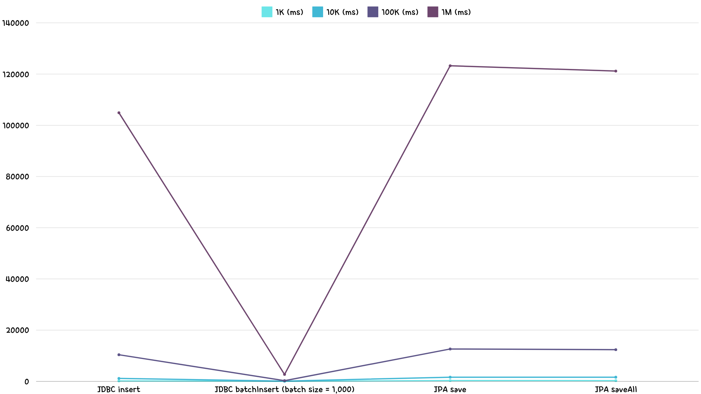

# JDBC, JPA 삽입 성능 비교

## 로컬 테스트

### 환경

- MacBook Pro, M3, 18GB
- Docker MariaDB 11.4.3

### JDBC insert, JDBC batchInsert, JPA save, JPA saveAll 처리 속도 비교

#### 1회차

|                                           | **1K (ms)** | **10K (ms)** | **100K (ms)** | **1M (ms)** |
|:-----------------------------------------:|:-----------:|:------------:|:-------------:|:-----------:|
|              **JDBC insert**              |     168     |     1139     |      9875     |    108585   |
| **JDBC batchInsert (batch size = 1,000)** |      25     |      143     |      265      |     2354    |
|                **JPA save**               |     339     |     1755     |     12466     |    126879   |
|              **JPA saveAll**              |     271     |     1481     |     12819     |    121481   |

#### 2회차

|                                           | **1K (ms)** | **10K (ms)** | **100K (ms)** | **1M (ms)** |
|:-----------------------------------------:|:-----------:|:------------:|:-------------:|:-----------:|
|              **JDBC insert**              |     163     |     1089     |     10849     |    103511   |
| **JDBC batchInsert (batch size = 1,000)** |      35     |      75      |      303      |     2437    |
|                **JPA save**               |     311     |     1527     |     13225     |    122072   |
|              **JPA saveAll**              |     283     |     1850     |     12285     |    119972   |

#### 3회차

|                                           | **1K (ms)** | **10K (ms)** | **100K (ms)** | **1M (ms)** |
|:-----------------------------------------:|:-----------:|:------------:|:-------------:|:-----------:|
|              **JDBC insert**              |     172     |     1206     |     10471     |    102597   |
| **JDBC batchInsert (batch size = 1,000)** |      21     |      73      |      250      |     3328    |
|                **JPA save**               |     299     |     1599     |     12216     |    120786   |
|              **JPA saveAll**              |     275     |     1560     |     12031     |    122068   |

#### 평균

|                                           | **1K (ms)** | **10K (ms)** | **100K (ms)** | **1M (ms)** |
|:-----------------------------------------:|:-----------:|:------------:|:-------------:|:-----------:|
|              **JDBC insert**              |     168     |     1145     |     10398     |    104898   |
| **JDBC batchInsert (batch size = 1,000)** |      27     |      97      |      273      |     2706    |
|                **JPA save**               |     316     |     1627     |     12636     |    123246   |
|              **JPA saveAll**              |     276     |     1630     |     12378     |    121174   |

### JDBC batchInsert, batch size에 따른 처리 속도 비교
